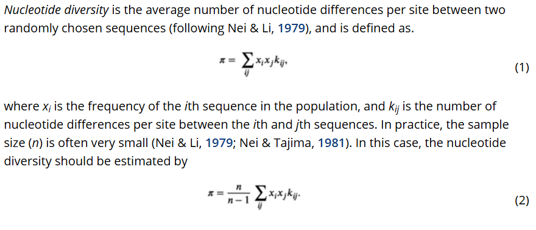

## UNIDAD 3
**Metódos de análisis** 
### Sesión 1
#### 3.2. Métodos genético-poblacionales y espaciales

##### Actividad 1 
Revisar 5 artículos recientes, y hacer un cuadro de resumen con los métodos y análisis genético-poblacionales y espaciales. 
Inlcuir información sobre:
- Nombre del análisis
- Software o paquete empleado.
- El tipo de datos requeridos para el análisis. 
- Pregunta(s) que responde.
- Inferencias posibles a partir de los resultados.

**Métodos genético-poblacionales** \
Los métodos de análisis de la filogeografía están diseñados para responder sus preguntas de estudio. 

La filogeografía es un campo de estudio que se ocupa de los principios y procesos que gobiernan las distribuciones geográficas de los linajes, especialmente a nivel intraespecífico [(Avise 1998).](https://www.ccg.unam.mx/~vinuesa/tlem/pdfs/Avise_History_Purview_Phylogeography_1998.pdf)

Muchas especies muestran una historia filogenética del DNA mitocondrial (DNAmt) profunda y estructurada geográficamente. El estudio de la relación entre genealogía y geografía constituye una disciplina que puede denominarse filogeografía intraespecífica [(Avise et al., 1987).](https://www.annualreviews.org/content/journals/10.1146/annurev.es.18.110187.002421)

La filogeografía tiene como objetivo investigar la relación entre la historia geográfica, la biogeografía y los mecanismos que impulsan la especiación [(Rius y Turon 2020).](https://www.frontiersin.org/journals/ecology-and-evolution/articles/10.3389/fevo.2020.595711/full)

Los análisis filogenéticos de datos genómicos con contexto geográfico, permiten establecer vínculos entre la filogenia y la genética de poblaciones [(Rius y Turon 2020).](https://www.frontiersin.org/journals/ecology-and-evolution/articles/10.3389/fevo.2020.595711/full)

• Linajes genéticos intraespecificos. \
• Genética de poblaciones / mecanismos de la especiación. \
• Historia demográfica.  \
• Historia geográfica. 

Los **métodos genético-poblacionales** se centran en analizar la estructura genética de las poblaciones y los factores (geográficos y ecológicos) que explican la relación entre la distribución de esos linajes, sus patrones de divergencia y procesos de diferenciación (*e.g*., variaicón genética, flujo genético, dinámicas demográficas).

**¿Por qué y para qué?** 

		      Estructura poblacional
El objetivo de los análisis de estructura poblacional es detectar el número de poblaciones genéticamente diferenciadas y sus límites [(Cunha HA 2022).](https://www.sciencedirect.com/science/article/abs/pii/B9780323909747000185)

**Red de haplotipos** \
Phylogeography and Genetic Diversity of Duck Mussel *Anodonta anatina* (Bivalvia: Unionidae) in Eurasia [(Lyubas *et al*., 2023)](https://www.mdpi.com/1424-2818/15/2/260#app1-diversity-15-00260). \

**Algunas interpretaciones** \

- Delimitación genética espacial 
- Haplotipos ampliamente distribuidos 
- Haplotipos abundantes y raros 
- Haplotipos endémicos (privados) 
- Haplotipos compartidos 
- Red de haplotipos en forma de estrella
- Diversidad haplotípica 

Conserved DNA sequence analysis reveals the phylogeography and evolutionary events of *Akebia trifoliata* in the region across the eastern edge of the Tibetan Plateau and subtropical China [(Dong *et al*., 2024).](https://bmcecolevol.biomedcentral.com/articles/10.1186/s12862-024-02243-0)

 \
(a) TCS-derived network of genealogical relationships between the 75 ITS (internal transcribed spacer) haplotypes. \
(b) TCS-derived network of genealogical relationships between the 22 haplotypes (rps16). \
(c) Sampling distribution map of 61 populations of *Akebia trifoliata*. Red, yellow, green and blue represent the different geographical locations of A (the eastern Tibetan Plateau), B (central northern China), C (central China) and D (eastern China), respectively.

**Software:** \
 [Network v.5](https://www.fluxus-engineering.com/Network10200_user_guide.pdf) (Foster 2020). \
[PopART](https://besjournals.onlinelibrary.wiley.com/doi/10.1111/2041-210X.12410) (Leigh and Bryant 2015).  \
[Pegas](https://cran.r-project.org/web/packages/pegas/vignettes/PlotHaploNet.pdf) (Paradis 2023).

**Structure** \
El programa STRUCTURE es un paquete de software libre que utiliza datos de genotipo multilocus para investigar la estructura poblacional. Sus usos incluyen inferir la presencia de poblaciones distintas, asignar individuos a poblaciones, estudiar zonas de hibridación, identificar migrantes e individuos mestizos, y estimar las frecuencias alélicas poblacionales en situaciones donde muchos individuos son migrantes o presentan mezcla genética (admixed) [(Pritchard Lab Software)](https://web.stanford.edu/group/pritchardlab/software.html). 

**Ejemplo**

[The tangled evolutionary history of a long-debated Mesoamerican taxon: The Velazquez Woodpecker (*Melanerpes santacruzi*, Aves: Picidae](linkinghub.elsevier.com/retrieve/pii/S1055-7903(22)00058-6) (Llanes-Quevedo et al., 2022).

Más información en [Detecting the number of clusters of individuals using the software structure: a simulation study](https://onlinelibrary.wiley.com/doi/abs/10.1111/j.1365-294X.2005.02553.x?casa_token=5pdjQdWObikAAAAA%3AYN0G1b4jGi7S7TNAnqv68PGqOe992cFkGN47NMnihhT_PGyfAcqgdGmEbQBIErfQVLCrGW4IYMMaocWm) (Evanno *et al*., 2005).

**PCA** \
El análisis de componentes principales (PCA) es una de las técnicas más útiles para visualizar la diversidad genética en un conjunto de datos. Aunque la metodología no se limita a datos genéticos, en general permite descomponer conjuntos de datos de alta dimensión en dos o más dimensiones para su visualización en un espacio bidimensional [(Stephan Schiffels)](https://comppopgenworkshop2019-readthedocs-io.translate.goog/en/latest/contents/03_pca/pca.html?_x_tr_sl=en&_x_tr_tl=es&_x_tr_hl=es&_x_tr_pto=tc).

**Ejemplo** \
 \
 [Phylogeography and Genetic Diversity of Duck Mussel *Anodonta anatina* (Bivalvia: Unionidae) in Eurasia](https://www.mdpi.com/1424-2818/15/2/260#app1-diversity-15-00260) (Lyubas et al., 2023).

	         Diferenciación poblacional

***F*ST** \
Las estadísticas F de Wright, y especialmente la
***F*ST**, ofrecen información importante sobre los procesos evolutivos que influyen en la estructura de la variación genética dentro y entre poblaciones, y se encuentran entre las estadísticas descriptivas más utilizadas en genética de poblaciones y genética evolutiva. 

La ***F*ST**  refleja los efectos combinados de la deriva genética, la migración, la mutación y la selección sobre la distribución de la variación genética entre poblaciones (Holsinger and Weir 2009). \
[Genetics in geographically structured populations: defining, estimating and interpreting *F*ST](https://www.nature.com/articles/nrg2611).

**Ejemplo** \

**AMOVA** \
El *Analysis of MOlecular VAriance*, es una técnica estadística utilizada para analizar la estructura genética de poblaciones. Permite estimar cómo se distribuye la variación genética en diferentes niveles jerárquicos (por ejemplo, entre regiones, entre poblaciones dentro de regiones, entre individuos dentro de poblaciones, etc). Por lo que ayuda a inferir procesos evolutivos como la migración, la deriva genética y la diferenciación poblacional (Meirmans 2012). \
[AMOVA-Based Clustering of Population Genetic Data](https://academic.oup.com/jhered/article-abstract/103/5/744/962053?redirectedFrom=fulltext).

(Vamos a revisar estos análisis más a fondo en la sesión 3, estadística filogeográfica).

		    Variación poblacional
La diversidad genética, que incluye π y h, es la medida más fundamental de la biodiversidad. En los últimos años, la medición de la diversidad genética se ha convertido en un tema atractivo en la investigación sobre biodiversidad y conservación debido al rápido aumento en la disponibilidad de grandes secuencias de ADN [(Fan et al., 2021)](https://besjournals.onlinelibrary.wiley.com/doi/full/10.1111/2041-210X.13643). 

**Diversidad haplotípica (*h*)** \
La diversidad haplotípica es la probabilidad de que dos haplotipos elegidos al azar sean diferentes (Fan et al., 2021). \
[An approach for estimating haplotype diversity from sequences with unequal lengths](https://besjournals.onlinelibrary.wiley.com/doi/full/10.1111/2041-210X.13643)

La diversidad haplotípica está controlada por una variedad de procesos, incluyendo la mutación, la recombinación, la selección de marcadores y la demografía (Stumpf, 2004). \
 [Haplotype diversity and SNP frequency dependence in the description of genetic variation](https://www.nature.com/articles/5201179).

*Some populations may show low haplotype diversity due to historical isolation, while others display high diversity because of frequent gene flow* [Molecular Ecology & Evolution](https://openpress.wheatoncollege.edu/molecularecologyv1/chapter/genetic-diversity/). 

Haplotipo \

No de sitios segregantes: 3 \
Proporción de SS: 1/9 \
No de haplotipos: 4 

**Diversidad nucleotídica** \
La diversidad nucleotídica es el número promedio de diferencias de nucleótidos por sitio entre dos secuencias elegidas al azar (Fan *et al*., 2021). \
[An approach for estimating haplotype diversity from sequences with unequal lengths](https://besjournals.onlinelibrary.wiley.com/doi/full/10.1111/2041-210X.13643).

Se espera que una población ancestral exhiba un mayor grado de diversidad nucleotídica que sus poblaciones descendientes. Esto se debe a que la acumulación de mutaciones a lo largo del tiempo conduce a una divergencia genética entre poblaciones, lo que significa que las diferencias en las secuencias nucleotídicas aumentan a medida que las poblaciones se separan (Shank and Hahn 2014). \
[Reanalysis suggests that genomic islands of speciation
are due to reduced diversity, not reduced gene flow](https://onlinelibrary.wiley.com/doi/pdf/10.1111/mec.12796).

		Historia evolutiva 
Entre las preguntas centrales que se exploran en biología están aquellas que buscan entender el momento y las tasas de los procesos evolutivos. Estimar con precisión los tiempos de divergencia entre especies es fundamental para comprender la biogeografía histórica, estimar las tasas de diversificación e identificar las causas de la variación en las tasas de evolución molecular.

**Tiempos de divergencia entre poblaciones (BEAST)** \
El objetivo de la estimación bayesiana del tiempo de divergencia es estimar la probabilidad posterior conjunta,
P(*R*, *T* | *S*, *C*), de las tasas de las ramas (*R*) y los tiempos (*T*), dados un conjunto de secuencias (*S*) y información de calibración (*C*):

*Modelado de tasas de sustitución específicas por linaje*  \
Muchos factores pueden influir en la tasa de sustitución en una población, como la tasa de mutación, el tamaño poblacional, el tiempo generacional y la selección. Como resultado, se han propuesto muchos modelos que describen cómo puede variar la tasa de sustitución a lo largo del Árbol de la Vida.

- Global molecular clock: una tasa constante de sustitución a lo largo del tiempo.
- Local molecular clocks: linajes estrechamente relacionadas comparten la misma tasa,
- Autocorrelated rates: las tasas de sustitución evolucionan de forma gradual a lo largo del árbol.
- Uncorrelated rates: la tasa asociada a cada rama se extrae de una única distribución paramétrica subyacente.
- Mixture model on branch rates: las ramas se asignan a distintas categorías de tasas.

**Nota:**
- Es importante que se realicen análisis para probar diferentes modelos de reloj relajado.
- También es fundamental tener en cuenta la escala de la pregunta al estimar los tiempos de divergencia. \
Por ejemplo, podría no ser razonable asumir que las tasas están autocorrelacionadas si el conjunto de datos incluye taxones muy lejanamente relacionados.

**Tree prior** \
Este modelo describe cómo se distribuyen los eventos de especiación a lo largo del tiempo. Cuando se combina con un modelo de tasa por rama, la inferencia bayesiana permite estimar los tiempos de divergencia relativos.

**Fenomenológicos:** modelos que no hacen suposiciones explícitas sobre los procesos biológicos que generaron el árbol. Estos priors son condicionales a la edad de la raíz.
- Distribución uniforme: este modelo simple asume que los nodos internos están distribuidos uniformemente entre la raíz y los nodos terminales.

**Mecanicistas:** modelos que describen los procesos biológicos responsables de generar el patrón de divergencia de linajes.

- Procesos a nivel poblacional: modelos que describen procesos demográficos (adecuados para describir diferencias entre individuos de la misma especie/población).
	- Modelo coalescente: modelos demográficos que describen el tiempo en generaciones entre eventos de coalescencia y permiten la estimación de parámetros a nivel poblacional.

- Procesos a nivel de especie: modelos estocásticos de ramificación que describen la diversificación de linajes (adecuados para describir el tiempo de divergencia entre muestras de diferentes especies):
	- Proceso de Yule: El modelo de ramificación más simple, que asume que en cualquier momento cada linaje vivo puede especiarse a la misma tasa, λ. Como la tasa de especiación es constante en el tiempo, hay un tiempo de espera exponencial entre eventos de especiación.
	- Proceso de nacimiento-muerte (birth-death): Una extensión del modelo de Yule, que asume que en cualquier momento cada linaje puede sufrir especiación a una tasa λ o extinguirse a una tasa µ.

**Calibración a un tiempo absoluto** \
Sin información externa para calibrar el árbol, los métodos de estimación del tiempo de divergencia solo pueden proporcionar estimaciones confiables de tiempos de divergencia relativos, pero no de las edades absolutas de los nodos.
La información de calibración puede provenir de diversas fuentes:
- Tasas de sustitución conocidas 
- Secuencias obtenidas de datos muestreados en diferentes tiempos (normalmente datos de virus).
- Estimaciones de fechas geológicas (como fósiles o datos biogeográficos).

**Calibraciones fósiles o biogeográficas.**  \
Los métodos bayesianos ofrecen una forma de tener en cuenta la incertidumbre en las calibraciones fósiles. Las distribuciones previas que reflejan nuestro conocimiento (o la falta del mismo) sobre el tiempo transcurrido desde el nodo ancestral hasta su fósil de calibración se incorporan fácilmente en estos métodos.

**Distribuciones paramétricas que pueden aplicarse como distribuciones a priori sobre la edad de un nodo calibrado** \

Esta parte estuvo patrocinada por Tracy Heath:
[Divergence Time Estimation using BEAST v2.](https://taming-the-beast.org/tutorials/FBD-tutorial/FBD-tutorial.pdf)

**Simulaciones bayesianas** \
Consisten de un conjunto de poblaciones discretas, para inferir los tiempos de divergencia, flujo genético, sus tamaños y tasas de crecimiento, migración entre esas poblaciones a lo largo de varios períodos, lo que puede requerir decenas de parámetros para describirse completamente

		Demografía histórica

Procesos pasados que estructuran los patrones de variación genética;
incluyen el tamaño poblacional, las tasas de migración, los tiempos de divergencia y la variación de estas cantidades a lo largo del tiempo (Knowles 2009).

La historia demográfica de una población deja una huella en los genomas de sus representantes actuales. Reconstruir esta historia puede brindarnos información valiosa sobre diversos procesos evolutivos y de genética de poblaciones, por ejemplo, al analizar correlaciones entre eventos demográficos y paleoclimáticos, examinar los factores que han impulsado las dinámicas poblacionales del pasado, o rastrear la transmisión y propagación de virus (Ho y Shapiro, 2011). \
[Skyline-plot methods for estimating demographic history from nucleotide sequences](https://onlinelibrary.wiley.com/doi/10.1111/j.1755-0998.2011.02988.x).

**Análisis:**
- Tajima’s D 
- Distribución mismatch 
- Skyline plots	
- Simulaciones bayesianas 

Estos los vamos a revisar en la sesión 4 correspondiente a inferencias demográficas. 

		Flujo genético e introgresión 

- IM

Los desafíos de inferir modelos de aislamiento (sin migración) e incluso de reconstruir la filogenia han sido abordados mediante el uso del marco de coalescencia multiespecífica. Sin embargo, ignorar la migración puede resultar en una estimación sesgada de los tiempos de divergencia entre poblaciones o especies, y puede conducir a una estimación incorrecta del árbol filogenético.

La deriva genética aumenta la divergencia entre poblaciones o entre especies, mientras que el flujo génico puede eliminar señales de dicha divergencia. Un modelo de aislamiento con migración (IM) es un modelo demográfico que describe estas dos señales contrapuestas. 

**Ejemplo** \
 \
Un modelo típico de IM para dos poblaciones, con seis parámetros, representa dos poblaciones (con tamaños poblacionales θ1 y θ2, respectivamente) que se originan a partir de una sola población ancestral (tamaño θa) en el tiempo Ts en el pasado, mientras que ambas poblaciones pueden intercambiar migrantes a tasas m1 y m2. Se asume que tanto los tamaños poblacionales como las tasas de migración se mantienen constantes a lo largo del tiempo.

**Modelo estándar** \
Al inferir un modelo de aislamiento con migración (IM) a partir de datos genéticos, los parámetros de interés son los parámetros demográficos del modelo IM:

	ψ = (θ1, θ2, θa, m1, m2, Ts). 

El locus *i*-ésimo, *Di*, de un total de *L* loci, corresponde a las observaciones, y la genealogía *Gi* de *Di* es una variable que no podemos observar. \
Estos modelos abordan dos niveles de incertidumbre: 
- La distribución de las secuencias de DNA dadas las genealogías.
- La distribución de las genealogías dadas las condiciones del modelo IM. 

Por lo general, se asume que no hay recombinación dentro de un locus y que existe recombinación libre entre loci. En otras palabras, cada locus *i*-ésimo (*Di*) tiene su propia genealogía (*Gi*) y los loci son independientes entre sí. 

**Comparación de los programas bayesianos MIST, AIM e IMa3 (serie IM/IMa)**

Ts = Tiempo, G = genealogía	, τ = árbol.

**Tener en cuenta** \
IMa3 y AIM estiman la topología del árbol poblacional y las tasas de migración, pero su escalabilidad a datos genómicos es limitada o aún no ha sido evaluada. \
MIST, en cambio, escala bien con datos genómicos y puede extenderse para inferir topologías del árbol poblacional.

Para más información [Recent advances in Bayesian inference of isolation-with-migration models](https://pmc.ncbi.nlm.nih.gov/articles/PMC6944047/) (Chung 2019).

- ABBA BABA

La llegada de los datos genómicos ha revelado el intercambio de material genético entre numerosas especies. \
El enfoque ABBA BABA fue desarrollado para cuantificar la cantidad de intercambio genético entre los neandertales y los humanos modernos [(Durand *et al*., 2011)](https://academic.oup.com/mbe/article/28/8/2239/1052492). 

***ILS* o Introgresión** \

La prueba considera alelos ancestrales (‘A’) y derivados (‘B’) a lo largo del genoma de cuatro taxones. Cuando no hay introgresión, se espera que estos patrones discordantes ocurran con igual frecuencia. 

**ABBA-BABA** \

Un exceso de cualquiera de estos dos patrones (ABBA o BABA), que resulta en un estadístico D significativamente diferente de cero, es indicativo de flujo génico entre dos taxones. Un estadístico D positivo (es decir, un exceso de ABBA) señala introgresión entre P2 y P3, mientras que un estadístico D negativo (es decir, un exceso de BABA) indica introgresión entre P1 y P3. \
[D-statistics for Dummies: A simple test for introgression](https://avianhybrids-wordpress-com.translate.goog/2019/11/09/d-statistics-for-dummies-a-simple-test-for-introgression/?_x_tr_sl=en&_x_tr_tl=es&_x_tr_hl=es&_x_tr_pto=tc).

**Sin grupo externo** \
Cuando no hay un grupo externo para determinar alelos derivados y ancestrales.\
Si los linajes A y B son hermanos en el árbol de especies, con un tiempo de divergencia t₁, y el ancestro de A y B se separó de la línea C en el tiempo t₂. Nos referimos a los árboles génicos que presentan esta topología como AB, de modo que las dos topologías discordantes son AC y BC.

**Topologías producidas por *ILS*** \

**Topologías producidas por introgresión** \

La fila superior muestra el mismo árbol de especies, pero con introgresión entre (a) las líneas B y C, o (b) las líneas A y C. 
La introgresión ocurre en el tiempo tm en ambos escenarios. La fila inferior muestra nuevamente las topologías no enraizadas aproximadas que resultan de la introgresión.

**Análisis** \
Consideremos un árbol con tres especies: A, B y C. \
A está más estrechamente relacionada con B que con C. \
En este caso, existen dos arreglos discordantes: AC y BC. 

**Relación entre la distancia genética y la topología para 3 poblaciones** \

La introgresión entre B y C conduce tanto a más árboles con una topología BC como a una menor distancia genética entre estas dos líneas. Como resultado, dB–C (la distancia genética entre B y C) será menor que dA–C (la distancia genética entre A y C), lo que lleva a un valor negativo de D3. Por el contrario, el flujo génico entre A y C produce valores positivos de D3. 

[ A Three-Sample Test for Introgression](https://academic.oup.com/mbe/article/36/12/2878/5543093) (Hahn and Hibbins 2019).

**Más información** \
[Using ABBA-BABA tests to infer gene
flow and genomic introgression from
genome data (WGS, radSeq, etc.)
 ](https://evomics.org/wp-content/uploads/2020/01/ABBA_BABA_intro_20200192.pdf) (Hannes Svardal y Milan Malinsky).

##### Práctica 1:
En esta prática vamos a reproducir algunos de los análisis genético-poblacionales realizados en [(Lyubas et al., 2023)](https://www.mdpi.com/1424-2818/15/2/260#app1-diversity-15-00260).

- [Descarga de secuencias](https://cran.r-project.org/web/packages/ape/ape.pdf) 
- [Alineamiento](https://bioconductor.org/packages/devel/bioc/vignettes/msa/inst/doc/msa.pdf)
- Red de Haplotipos
- Mapa de distribución de haplotipos
- PCA

### Sesión 2
#### 3.2. Métodos genético-poblacionales y espaciales
Los métodos espaciales integran la información geográfica con los datos genéticos para inferir patrones históricos de dispersión, barreras geográficas y/o ecológicas al flujo genético, eventos de aislamiento, áreas de contacto secundario, etc.

##### Actividad 2 
1) Discusión sobre métodos espaciales y su aplicación en filogeografía: \
[Integrating statistical genetic and geospatial methods brings new power to phylogeography](https://www.sciencedirect.com/science/article/abs/pii/S1055790311000480) (Chan et al., 2011).

2) Seleccionar un artículo de los que revisaron y escoger un análisis espacial o genético, y desarrollarlo en detalle: 
Cuál es su base teoríca? 
Qué tipo de datos se requieren? 
Qué pregunta responde? 
Qué se puede interpretar a partir de sus resultados? 
Cómo se relaciona con su estudio? 
Qué necesitarían hacer/tener para realizar ese análisis? 
(10 mins máx).

		Estructura geográfica
**Geneland**  \
The main task of Geneland consists in clustering a sample of population genetics data into a certain number
of populations in such a way that each population is approximately at Hardy-Weinberg equilibrium with linkage
equilibrium between loci (HWLE). Different algorithms based on different models are implemented. The most
popular algorithm is based on a spatial model and makes use not only of genotypes but also of spatial coordinates
of sampled individuals [(Guillot et al., 2011.)](https://backend.orbit.dtu.dk/ws/portalfiles/portal/6334216/Geneland-Doc.pdf) 

Diversification and secondary contact in the magpie-jays (*Calocitta*) throughout the pacific lowlands of Mesoamerica [(Sánchez-González, et al 2021)](https://onlinelibrary.wiley.com/doi/abs/10.1111/jzs.12571). 

Más información en [gilles-guillot/Geneland](https://github.com/gilles-guillot/Geneland) en GitHub.

		Barreras geográficas y ecológicas

- Barrier
- Modelos de nicho ecológico
- LCP

**Recomendaciones**  \
Un resumen de métodos genéticos espaciales, más orientado a genética del paisaje en 
[Métodos de análisis genéticos, espaciales y de conectividad en genética del paisaje](https://www.scielo.org.mx/img/revistas/rmbiodiv/v84n3/a35c1.jpg) (Garrido-Garduño y Vázquez-Domínguez 2013). \
Para los que estén interesados en MNE [A checklist for maximizing reproducibility of ecological niche models](https://www.nature.com/articles/s41559-019-0972-5) (Feng *et al* 2019). 

##### Práctica 2:
En esta prática vamos a implementar un análisis genético-espacial para [(Lyubas *et al*., 2023)](https://www.mdpi.com/1424-2818/15/2/260#app1-diversity-15-00260).

- Red de Haplotipos
- Mapa de distribución de haplotipos
- PCA
- Barrier/Geneland

### Sesión 3
#### 3.4. Estadística filogeográfica 

##### Actividad 3 
Artículo de discusión: Statistical Phylogeography [(Knowles 2009).](https://www.annualreviews.org/content/journals/10.1146/annurev.ecolsys.38.091206.095702)

**Statistical
phylogeography:** 
- Demographic inference
that takes into account
the stochasticity of
genetic processes (Knowles 2009). 

- Un campo interdisciplinario que busca comprender los procesos que subyacen a las dimensiones espaciales y temporales de la variación genética, combinando información proveniente de datos genéticos, ecológicos y paleontológicos (Csilléry, 2010). \
[Approximate Bayesian Computation (ABC) in practice](https://www.sciencedirect.com/science/article/abs/pii/S0169534710000662).

**Diversidad haplotípica (h)** \

**Haplotipo** \

No de sitios segregantes: 3 \
Proporción de SS: 1/9 \
No de haplotipos: 4 

**Ejemplo 1**:

*pi* relative frequency of each haplotype: \
haplotype 1 = 2/5   = 0.4  \
haplotype 2 = 2/5   = 0.4  \
haplotype 3 = 3/20  = 0.15 \
haplotype 4 = 1/20  = 0.05

h = 20/19\*(1-(0.4^2+0.4^2+0.15^2+0.05^2)) \
h = 1.05\*(1-(0.16+0.16+0.0225+.0025) \
h = 1.05\*(1-(0.345)        \
h = 1.05\*0.655 \
h = 0.69 

**Ejemplo 2** \
Si solo hay un haplotipo \
haplotype 1 = 20/20 = 1  

h = 20/19\*(1-(1^2))  \ 
h = 20/19\*(0) \
h = 0: La probabilidad de tomar dos haplotipos al azar y que estos sean diferentes cuando solo hay un haplotipo es 0. 

**Ejemplo 3** \
para 1000 haplotipos \
haplotype 1 = 1/1000 = 0.001  \
... \
haplotype 1000 = 1/1000 = 0.001 

h = 1000/999\*(1-(0.001^2 * 1000)) \
h = 1000/999\*(1-(0.000001\*1000)) \
h = 1000/999\*1-((0.001)) \
h = 1000/999\*(0.999) \
h = 1: La probabilidad de tomar dos haplotipos al azar y que estos sean diferentes cuando los **1000** haplotipos son **diferentes**.

**Diversidad nucleotídica (π)** \

**Ejemplo 1** \
50 * Haplotipo 1: **ATCATCATCATCATCA** \
50 * Haplotipo 2: **CTACTACTACTATCAC** 

*xi* is the frequency of the ith sequence in the population: \
Haplotipo 1 = 0.5   \
Haplotipo 2 = 0.5

*kij* is the number of nucleotide differences per site between the ith and jth sequences: \
kij haplotype 1 - haplotype 2 = 16/16 = 1

**Calcular π** \
π = 100/99(0.5\*0.5\*1) 
π = 0.25 \
Si tomamos dos haplotipos al azar en una población de 100 individuos, con dos haplotipos con igual frecuencia, y los 2 haplotipos son completamente distintos, esperamos en promedio 25% de diferencias nucleotídicas. 

**Ejemplo 2** \
50 \* Haplotipo 1: AC**T**ATCAGGA**T**ATGT 
 
950 \* Haplotipo 2: AC**C**ATCAGGA**C**ATGT

*xi* is the frequency of the ith sequence in the population: \
Haplotipo 1 = 0.05   \
Haplotipo 2 = 0.95

*kij* is the number of nucleotide differences per site between the ith and jth sequences: \
haplotype 1 - haplotype 2 = 2/16 = 0.125  

**Calcular π** \
π = 1000/999(0.95\*0.05\*0.125)  \
π = 0.006 \
Si tomamos dos haplotipos al azar en una población de 1000 individuos, con dos haplotipos con un haplotipo en mucho mayor frequencia frecuencia, y los 2 haplotipos con poca diferenciación, esperamos en promedio 0.6 % de diferencias nucleotídicas. 

**Ejemplo 3** \
Haplotipo 1:    ATCATCATCATCATCA \
Haplotipo 2:    CTACTACTACTATCAC \
... \
Haplotipo 1000 

*xi* is the frequency of the ith sequence in the population: \
Haplotipo 1 = 0.001   \
Haplotipo 2 = 0.001 \
... \
Haplotipo 100 = 0.001 

*kij* is the number of nucleotide differences per site between the ith and jth sequences: \
haplotype 1 - haplotype 2 = 900/1000 = 0.9  \
... \
haplotype i - haplotype j = 900/1000 = 0.9

combinatoria de 1000: 499500

**Calcular π** \
π = 1000/999(0.001\*0.001\*0.9)*499500 \
π = 1000/999(0.0000009)*499500 \
π = 0.45 \
Si tomamos dos haplotipos al azar en una población de 1000 individuos, con 1000 haplotipos diferentes, y todos altamente diferentes, esperamos en promedio 45 % de diferencias nucleotídicas. 

Más información  en: *An approach for estimating haplotype diversity from sequences with unequal lengths* [(Fan et al., 2021)](https://besjournals.onlinelibrary.wiley.com/doi/full/10.1111/2041-210X.13643).

**Ejemplos** \
*reduced nucleotide diversity, reduced nucleotide divergence, and an excess of low-frequency variants, consistent with the action of natural selection* (Booker and Keight/ley 2018). \
[Understanding the Factors That Shape Patterns of Nucleotide Diversity in the House Mouse Genome (*Neotoma Micropus*)](https://pmc.ncbi.nlm.nih.gov/articles/PMC6278861/).

*Low nucleotide-diversity values in addition to high haplotype-diversity values indicate a high number of closely related haplotypes, and suggest that this population may have undergone a recent expansion* (Mendez-Harclerode et al., 2007). \
[Molecular Evidence For High Levels of Intrapopulation Genetic Diversity in Woodrats (*Neotoma Micropus*)](https://pmc.ncbi.nlm.nih.gov/articles/PMC2771888/).

*The combination of high haplotype diversity and low nucleotide diversity, as observed in present study, can be a signature of a rapid demographic expansion from a small effective population size (Joshi et al., 2013).* \
[Genetic Variation and Phylogenetic Relationships of Indian Buffaloes of Uttar Pradesh](https://www.animbiosci.org/journal/view.php?number=4762).

**Qué valores de h y π se reportan en los artículos que revisaste?**

**Estadísticos F** \
Los estadísticos F de Wright, y especialmente la ***F*ST**, ofrecen información importante sobre los procesos evolutivos que influyen en la estructura de la variación genética dentro y entre poblaciones, y se encuentran entre las estadísticas descriptivas más utilizadas en genética de poblaciones y genética evolutiva.

***F*ST** \
Refleja los efectos combinados de la deriva genética, la migración, la mutación y la selección sobre la distribución de la variación genética entre poblaciones (Holsinger and Weir 2009).
[*Genetics in geographically structured populations: defining, estimating and interpreting ***F*ST**](https://www.nature.com/articles/nrg2611).

**Fórmula** \

***F*ₛₜ** = Reducción en la heterocigisidad que es debida a la estructura de la población. \
**Hₜ** = diversidad genética total o heterocigosidad esperada en la población total, estimada a partir de las frecuencias alélicas agrupadas. \
**Hₛ** = heterocigosidad esperada promedio estimada a partir de cada subpoblación.

**Ejemplo 1**

**Estimar las frecuencias alélicas de la metapoblación:** \
Metapoblación \
R = 6/10 = 0.6 \
A = 4/10 = 0.4 o 1-R

**Estimar la heterosigosis para la metapoblación** \
***H*T** = 1-(0.6^2+0.4^2) \
***H*T** = 1-(0.36+0.16) \
***H*T** = 1-(0.52) \
***H*T** = 0.48 

Subpoblación 1 \
R = 2/5 = 0.4 \
A = 1-R = 1 - 0.4 = 0.6

**Estimar la heterosigosis para la subpoblación 1** \
***H*S** = 1-(0.6^2+0.4^2) \
***H*S** = 1-(0.36+0.16) \
***H*S** = 1-(0.52) \
***H*S** = 0.48 

**Estimar la heterosigosis para la subpoblación 2** \
Subpoblación 2 \
R = 2/5 = 0.4
A = 1-R = 1 - 0.4 = 0.6

***H*S** = 1-(0.6^2+0.4^2) \
***H*S** = 1-(0.36+0.16) \
***H*S** = 1-(0.52) \
***H*S** = 0.48

***F*ST** = Hₜ = 0.48 - Hₛ = 0.48 / Hₜ = 0.48 \
***F*ST** = 0 -> No hay diferenciación genética entre las poblaciones que se están comparando.

**Ejemplo 2**

Estimar la proporción de alelos para la metapoblación:

Metapoblación \
R = 6/11 = 0.54 \
A = 1-R = 0.46 

***H*T** = 1-(0.54^2+0.46^2) \
***H*T** = 1-(0.29+0.21) \
***H*T** = 1-(0.50) \
***H*T** = 0.5 

Subpoblación 1 \
R = 6/6 = 1 \
A = 1-R = 1 - 1 = 0

***H*S** = 1-(1^2+0^2) \
***H*S** = 1-(1) \
***H*S** = 0 

Subpoblación 2 \
R = 0/5 = 0
A = 1-R = 1 - 0 = 1

***H*S** = 1-(0^2+1^2) \
***H*S** = 1-(1) \
***H*S** = 0 

***F*ST** = (***H*T** - ***H*S**) /  ***H*T** = (0.5 -  0) / 0.5 = 1 \
***F*ST** = 1 -> Las poblaciones son completamente diferentes.

**AMOVA (Análisis de varianza molecular)** 

Es una técnica estadística utilizada para analizar la estructura genética de poblaciones. Permite estimar cómo se distribuye la variación genética en diferentes niveles jerárquicos (por ejemplo, entre regiones, entre poblaciones dentro de regiones, entre individuos dentro de poblaciones, etc). Por lo que ayuda a inferir procesos evolutivos como la migración, la deriva genética y la diferenciación poblacional (Meirmans 2012). 

**Ejemplo para hacer el análisis AMOVA**

Considera el siguiente set de datos:

		Ind. 	Pop. 1	 Pop. 2	 Pop. 3
			 A1 A2 	 A1 A2 	  A1 A2
 	 	 1 	  0  0 	  0  1	   1  1
		 2	  1  1	  0  1	   1  1
		 3	  0  0	  1  1	   0  1
		 4	  1  0	  1  0	   1  1
		 5	  0  0	  0  1	   0  1
		 6	  0  0	  0  1	   0  0
		 7	  1  1	  1  1	   1  1
		 8	  0  0	  1  1	   0  0
		 9	  1  0	  1  1	   1  0
		 10	  1  1	  1  0	   0  1
		 11	  1  0	  0  1	   1  1
		 12	  0  0	  1  1	   1  0
		 13	  1  1	  1  1	   0  1
		 14	  1  1	  1  0	   1  0
		 15	  1  1	  0  1	   1  0

Vamos a estimar la variación que hay en 3 niveles de agrupación o efectos: \
**efecto a**: *k* = 3 poblaciones. \
**efecto b**: *i* = 15 individuos.  \
**efecto w**: *j* = 2 alelos.

Se calculan las sumas de presencias (1) para poder proceder con la suma de cuadrados. Los cálculos se realizan primero para una población y se continúan con las demás hasta obtener (X...k). 

**X...k** es el resultado de sumar todas las presencias de bandas (1) en los individuos por población. \
**X...k²** es el resultado de elevar al cuadrado el número obtenido anteriormente. \
**ΣXi...k²** es el resultado de sumar los cuadrados de las sumas de presencias de alelos en cada individuo (por ejemplo, Individuo 1 en Población 1 será (0 + 0)² + Individuo 2 en Población 1 (1 + 1)² + Individuo ...).	\
**ΣΣΣXijk²** es la suma de cada valor individual al cuadrado.
			
		           Pop1 Pop2  Pop3  Total
 		X...k    =  15   21    18     54
		X...k²   =  225  441   324    990 
		ΣXi...k² =  27   33    28     88 
		ΣΣΣXijk² =  15   21    18     54
		X...² =                      2916

Suma de cuadrados de los efectos de a, b y w. 

**SSa:** La parte de la varianza entre grupos, repecto la varianza total.
**SSb:** La parte de la varianza entre individuos, respecto de la varianza total.
**SSw:** La parte de la varianza dentro de individuos, respecto de la varianza entre individuos.
	
**Cálculo**
	
	SSa = ΣX...k²/ij – X...²/ijk = [990/(15 x 2)] - [2916/(15 x 2 x 3)] = 0.6
	SSb = ΣXi...k²/j – X...k²/ij = [88/2] - [990/(15 x 2)] = 11 
	SSw = ΣΣΣXijk²  – ΣXi...k²/j =   54  - [88/2] = 10

**MS** son los medias cuadradas de los efectos a, b y w, donde df se refiere a los grados de libertad del efecto a, b y w.

Estos son los resultados:

	MSa: SSa/dfa = 0.6/2 = 0.3
	MSb: SSb/dfb = 11/42 = 0.262
	MSw: SSw/dfw = 10/45 = 0.222

 Las medias cuadradas esperadas son: 
 
 	σw^2 = 0.2222222(varianza dentro de individuos).
 	σb^2 = (MSb−MSw)/2 = (0.26190476 − 0.22222222)/2 = 0.01984127 (varianza entre individuos dentro de las poblaciones).
 	σa^2 = (MSa−MSb)/2*15 = (0.3 − 0.26190476)/30 = 0.0012698 (varianza entre poblaciones).
 	σ^2 = σw^2 + σb^2 + σa^2 = 0.2222222 + 0.0198413 + 0.0190476 = 0.2611111 (varianza total estimada).

​En resumen

	 	    SV           df 	SS 	   MS	           EMS
		Populations      2      0.6 	 0.3	    σw^2 + 2σb^2 + 2⋅15⋅σa^2
		​Indiv./pop.      42     11    0.26190476    σw^2 + 2σb^2
		Within indiv.    45     10    0.22222222    σw^2

**Estimates de las varianzas**

		σa^2 = 0.0012698
		σb^2 = 0.0198413
		σw^2 = 0.2222222
		σ^2  = 0.24333

**Calcular los estadísticos F** \
***F*IT** = (σa^2 + σb^2)/σ^2 = (0.0012698 + 0.0198413)/0.24333 = 0.086758 \
***F*ST** = σa^2/σ^2 = 0.0012698/0.24333 = 0.0052185 \
​***F*IS** = σb^2/(σb^2 + σw^2) = 0.0198413/(0.0198413 + 0.222222) = 0.0819672

**Recuerden**
		 
   (1 - ***F*IT**) = (1 - ​***F*IS**)(1 - ***F*ST**)

 		1-0.086758 = (1-0.0819672)*(1-0.0052185)
            0.913242   =  0.9180*0.9947
            0.913242   =  0.913242

La diferenciación en la frecuencia alélica entre las tres poblaciones es muy baja (***F*ST** = 0.0052185), mientras la mayor parte de la varianza está en σw^2 = 0.2222222, es decir, dentro de individuos, por lo que probablemente se debe a numerosos apareamientos al azar.

**Ejemplo**

 \
**En que nivel se encuentra el mayor componente de variación?** \
**Qué sugiere el valor de **FST**?**  \
Este ejemplo está en [Laboratorio 3: Estructura genética](https://biologia.ucr.ac.cr/profesores/Fuchs%20Eric/Laboratorio%204%20-%20Estructura%20AMOVA%20y%20DAPC.html) de (Carvajal Rojas et al., 2019).

**Recomendaciones** 
- Para un [repaso](https://cropgenebank.sgrp.cgiar.org/images/file/learning_space/molecular_markers/volume2/04_Measures.pdf) y revisar otras medidas de variación genética
de la Universidad de Cornell. 
- Para una revisión más amplia y más profunda [Lecture Notes
in
Population Genetics](https://darwin1.eeb.uconn.edu/eeb348-notes/Lecture-Notes-in-Population-Genetics.pdf) por Kent Holsinger, de la Universidad de Connecticut. 
- [Fórmulas AMOVA](https://mothur.org/wiki/amova/)
- Ejmplo [AMOVA en R](https://grunwaldlab.github.io/Population_Genetics_in_R/AMOVA.html) por Kamvar et al., en Population genetics and genomics in R.

##### Práctica 3:
En esta prática vamos a reproducir algunos análisis de variación genética y estructura poblacional realizados en [(Lyubas et al., 2023)](https://www.mdpi.com/1424-2818/15/2/260#app1-diversity-15-00260).

- Red de Haplotipos
- Mapa de distribución de haplotipos
- PCA
- Barrier/Geneland
- Diversidad haplotípica
- Diversidad nucleotídica
- *F*ST
- AMOVA

