## UNIDAD 4 
**Ejemplos y estudios de caso**

### Sesión 4
#### 4.2. Inferencias demográficas
**Historia demográfica** \
Procesos pasados que estructuran los patrones de variación genética;
incluyen el tamaño poblacional, las tasas de migración, los tiempos de divergencia y la variación de estas cantidades a lo largo del tiempo (Knowles 2009).

La historia demográfica de una población deja una huella en los genomas de sus representantes actuales. Reconstruir esta historia puede brindarnos información valiosa sobre diversos procesos evolutivos y de genética de poblaciones, por ejemplo, al analizar correlaciones entre eventos demográficos y paleoclimáticos, examinar los factores que han impulsado las dinámicas poblacionales del pasado, o rastrear la transmisión y propagación de virus (Ho y Shapiro, 2011). \
[Skyline-plot methods for estimating demographic history from nucleotide sequences](https://onlinelibrary.wiley.com/doi/10.1111/j.1755-0998.2011.02988.x).

Pruebas y modelos para inferir expansión demográfica o estabilidad.
- Tajima’s D 
- Distribución mismatch o diferencias pareadas 
- Site Frequency Spectrum (SFS)
- Modelos poblacionales
- Métodos ABC
- Métodos de Skyline-plots

**D-Tajima** \
La D de Tajima se calcula como la diferencia entre dos medidas de diversidad genética: el número promedio de diferencias por pares (θπ) y el número de sitios segregantes (θS), cada una escalada de forma que se espera que sean iguales en una población de tamaño constante que evoluciona de manera neutral. 

El propósito de la prueba D de Tajima es distinguir entre una secuencia de ADN que evoluciona de manera neutra y una que evoluciona bajo un proceso no aleatorio, incluyendo selección direccional o balanceada, expansión o contracción demográfica, genetic hitchhiking, o introgresión (Korneliussen *et al*, 2013). \
[Calculation of Tajima’s D and other neutrality test statistics from low depth next-generation sequencing data](https://bmcbioinformatics.biomedcentral.com/articles/10.1186/1471-2105-14-289).

**Recordando la teoría de coalescencia**  \
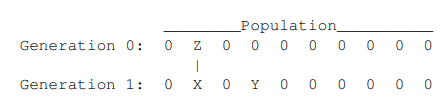 \
La línea vertical indica que el gen Z es el progenitor del gen X. \
¿Cuál es la probabilidad de que también sea el progenitor del gen Y? 

	              h = 1/10		 

El tiempo medio de coalescencia es de 10 generaciones, es decir, el número de genes en la población. Si hay 2𝑁 genes en una población, entonces

			 h = 1/2N  (1)

Un par promedio de genes compartió un ancestro común hace 
2𝑁 generaciones.

**Ejercicio** \
Supongamos que un par promedio de genes mitocondriales compartió por última vez un ancestro común hace 100,000 años. ¿Qué implicaría esto sobre el tamaño poblacional? Usa un tiempo generacional de 25 años.

El tiempo medio de coalescencia es de 4000 generaciones, entonces.
		
		h = 1/4000

Despejando N de (1)
		
		h = 1/2N
	  2Nh = 1
	  	N = 1/2h  
	 	N = 1/2(1/4000)
	    N = 2000		

**Nota:** Hay 𝑘(𝑘−1)/2 formas de elegir 2 elementos de un conjunto de 𝑘. Hay 𝑘 formas de elegir el primer elemento. Una vez elegido este, hay k−1 formas de elegir el segundo, por lo que hay 𝑘(𝑘−1)pares posibles. Sin embargo, esto cuenta el par AB por separado del par BA. Como estamos interesados en pares no ordenados, el número correcto de combinaciones es 𝑘(𝑘−1)/2.

Ahora imagina una muestra de *i* genes, hay *i*(*i* − 1)/2 pares de genes. La probabilidad de que los dos genes sean copias del mismo gen parental es igual a 1/2𝑁.
En consecuencia, podríamos esperar que la probabilidad de un evento de coalescencia sea aproximadamente:

         𝑖(𝑖−1)/2 * 1/2𝑁 =  
         ℎ𝑖 = 𝑖(𝑖−1)/4𝑁  (2)

Como vimos en el ejemplo, la duración esperada de este intervalo es:

     1/ℎ𝑖 = 4N/𝑖(𝑖−1) (3)

Por ejemplo, en una muestra de tamaño 4:
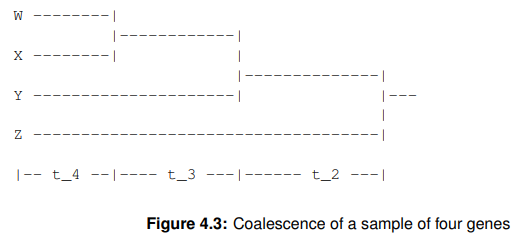

los cuatro intervalos de coalescencia tienen las siguientes probabilidades de coalescencia y longitudes esperadas:

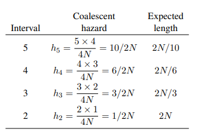

**La profundidad del árbol** es la suma de sus intervalos de coalescencia, y ya tenemos una fórmula para la duración esperada de cada intervalo:

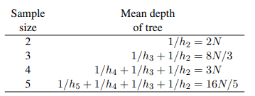

**El número de mutaciones en una genealogía de genes**
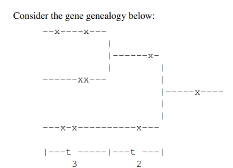

El número esperado de mutaciones depende no solo de la tasa de mutación, 𝑢, sino también de la longitud total de la genealogía de genes. En una muestra de 3 genes, esta longitud es:

				𝐿 = 3𝑡_3 + 2𝑡_2

Vimos que: 

	𝐸[𝑡_2] = 2𝑁 y E[t_3]= 2N/3 

Por lo tanto:

	𝐸[𝐿] = 3𝐸[𝑡_3] + 2𝐸[𝑡_2] = 2𝑁 + 4𝑁

En general, la duración esperada del intervalo de coalescencia durante el cual hay *i* linages es:

		E[t_i] = 4N/i(i - 1)

la contribución de este intervalo a la **longitud esperada total del árbol** (incluyendo todas las ramas) es:

		iE[t_i] = 4N/(i - 1)

la longitud total esperada del árbol es: 

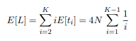

Donde 𝐾 es el número de genes en la muestra. El número esperado de mutaciones en la genealogía génica es, por lo tanto:

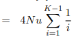

donde 𝑢 es la tasa de mutación por generación, y 𝜃 = 4𝑁𝑢

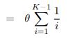

**Entonces, el número estimado de sitios segregantes se calcula mediante:**

		E[S] = θ{1 + 1/2 + 1/3 + · · · + 1/(K − 1)}

Despejando θ_S

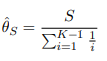

**Entonces, *θ_S* es proporcional al producto de la tasa de mutación y el tamaño poblacional.**

**Ejemplo** \
Estima el valor *θ_S* para la siguiente muestra. \
 

Contamos el número de **sitios polimorfimos *S***
		
		S = 20

Hacemos la suma de la longitud esperada del árbol a1, hasta *k*-1, donde *k* es el número de secuencias genéticas.

		a1 = 1 + 1/2 + 1/3 + 1/4 = 2.08

Usando la fórmula

		θ_S	= 20/2.08 = 9.62

 **Otra manera de estimar θ**

El número de diferencias en los sitios nucleotídicos entre un par de secuencias es el mismo que el número de sitios segregantes (posiciones con variación) en una muestra de tamaño 2. θ_S indica el número de sitios en que un par promedio de secuencias difiere. Promediar esto entre todos los pares de una muestra no cambia este valor esperado, por lo tanto, el valor esperado de π también es θ.

	E[π] = θ

**Ejemplo** \
Se compara cada par de secuencias y calcula el número promedio de polimorfismos entre dos secuencias. Se deben hacer diez comparaciones (combinaciones de cinco elementos tomados de a dos). 

**Comparación** | **Polimorfismos** \
Ind1-Ind2		|		 16 \
Ind1-Ind3	     |        11 \
Ind1-Ind4         |       9 \
Ind1-Ind5          |      0 \
Ind2-Ind3           |    14 \
Ind2-Ind4            |   10 \
Ind2-Ind5             |  16 \
Ind3-Ind4              | 12 \
Ind3-Ind5               | 11 \
Ind4-Ind5                | 9 

**Heterocigosis promedio** \
θ_π = (16 + 11 + 9 + 0 + 14 + 10 + 16 + 12 + 11 + 9) / 10 = 108/10 = 10.8 

**D-Tajima** \
d = θ_π- θ_S \
d = 10.8 - 9.62 = 1.18

**Cómo se interpreta?**
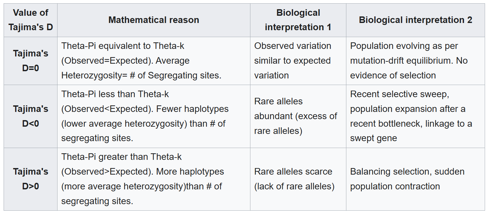

**Ejemplo 2**

**Comparación** | **Polimorfismos** \
Ind1-Ind2		|		 1 \
Ind1-Ind3	     |        1 \
Ind1-Ind4         |       1 \
Ind1-Ind5          |      0 \
Ind2-Ind3           |    0 \
Ind2-Ind4            |   2 \
Ind2-Ind5             |  1 \
Ind3-Ind4              | 2 \
Ind3-Ind5               | 1 \
Ind4-Ind5                | 1 

**Calcular θ_S** \
**θ_S = S/a1**

S = 2 \
a1 = 1 + 1/2 + 1/3 + 1/4 = 2.08 \
θ_S = 2/2.08 = **0.96**

**Calcular θ_π**  \
**Heterocigosis promedio** \
θ_π = (1 + 1 + 1 + 0 + 0 + 2 + 1 + 2 + 1 + 1) / 10 = 10/10 = 1

**D-Tajima** \
d = 1 - 0.96 = 0.04

**Interpretación** \

**Distribución mismatch** \
Se emplean para inferir procesos de demografía histórica. 

Se cuenta el número de diferencias por sitio entre cada par de secuencias en una muestra y usa los conteos resultantes para construir un histograma. El resultado es una “distribución de diferencias pareadas” (mismatch distribution). 

**Ejemplo** 

Considera las siguientes secuencias
		
		S01 A A A C T G T C A T
		S02 . . . . . A . T . .
		S03 . . G . . A . . . .
		S04 . . G . . A . T . .
		S05 . . . . . A . . . .

Para calcular la distribución de diferencias (mismatch distribution), es necesario contar las diferencias entre cada par de secuencias.

	   	Pareja             diferencias
		1 × 2			2
		1 × 3 			2
		1 × 4 			3
		1 × 5 			1
		2 × 3 			2
		2 × 4			1
		2 × 5 			1
		3 × 4 			1
		3 × 5 			1
		4 × 5 			2

La i-ésima entrada de la distribución de diferencias representa el número de pares de secuencias que difieren en i sitios.

La distribución de diferencias es:
	
	    Diferencias     frecuencia
		0 	    	0
		1	        5
		2 	        4
		3 		1

También se puede expresar como frecuencia relativa:

  		   Diferencias     frecuencia
			0	       0.0
			1 	       0.5
			2 	       0.4
			3 	       0.1

**La distribución esperada de diferencias pareadas entre secuencias genéticas bajo un modelo de evolución neutra con tamaño de población constante.**

El valor esperado de diferencias pareadas para un par aleatorio de secuencias que difiere en *i* sitios, y está bajo un modelo de tamaño poblacional constante y neutralidad selectiva está dado por: 

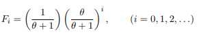

donde 
𝜃 = 4𝑁𝑢, 𝑢 es la tasa de mutación por generación, y 2N es el número de genes en la población.

**Ejemplo** \
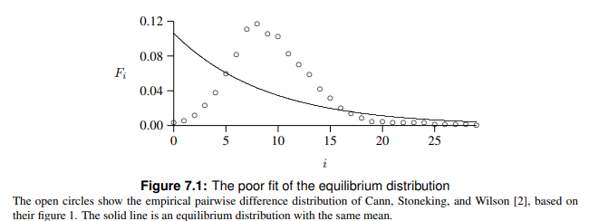

El poco ajuste entre las curvas observadas y las esperadas es llamativa. Hay varias hipótesis a considerar:

- Error de muestreo.
- Procesos de selección.
- No se cumple la hipótesis de sitios infinitos.
- Apareamiento no aleatorio.
- Variación en el tamaño de la población

En una población que ha permanecido estacionaria durante mucho tiempo, las distribuciones obtenidas a partir de secuencias de ADN no recombinante se vuelven irregulares y erráticas. En cambio, una población en crecimiento genera distribuciones de diferencias pareadas que son suaves y presentan un pico. La posición de ese pico refleja el momento en que ocurrió el crecimiento poblacional [(Harpending 1994)](https://europepmc.org/article/med/8088750).

**Ejemplo** \
**Distribuciones de diferencias pareadas.**
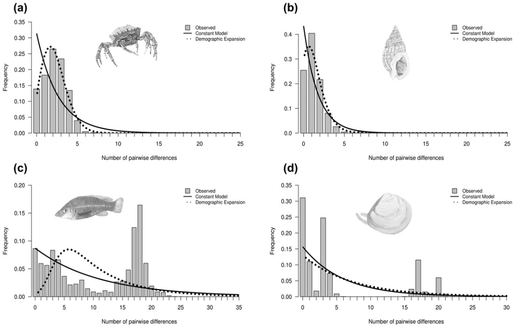

**(A)** La distribución unimodal está asociada con una expansión poblacional repentina (por ejemplo, *Maja brachydactyla*). \
**(B)** La distribución unimodal sesgada generalmente está asociada con una expansión o cuello de botella reciente (por ejemplo, *Nassarius reticulatus). \
 **(C)** Las distribuciones multimodales (por ejemplo, *Labrus bergylta*) y bimodales (por ejemplo, *Macoma balthica*) generalmente están asociadas con un tamaño poblacional constante. 

Las distribuciones bimodales también podrían indicar la presencia de dos linajes distintos, lo que potencialmente violaría las suposiciones de la teoría de la coalescencia si se analizara como una sola población "genética". En este caso, el primer pico representaría las diferencias intra-clado entre pares, mientras que el segundo pico probablemente representaría diferencias inter-clado más antiguas.
[(Jenkins et al., 2018)](https://peerj.com/articles/5684/)

**Site Frequency Spectrum (SFS)**

El espectro de frecuencia de sitios, es la distribución conjunta de las frecuencias alélicas entre una o más poblaciones, y funciona como una estadística resumen importante en genética de poblaciones. Por ejemplo, el SFS es suficiente para calcular la diversidad nucleotídica y los estadísticos F y *F*ₛₜ. Además, el SFS puede utilizarse para inferir la historia demográfica y procesos de selección. \
[Estimation of site frequency spectra from low-coverage sequencing data using stochastic EM reduces overfitting, runtime, and memory usage](https://pmc.ncbi.nlm.nih.gov/articles/PMC9713400/).

En una muestra de K genes, un sitio polimórfico puede dividir la muestra en 1 mutante y K − 1 no mutantes, en 2 mutantes y K − 2 no mutantes, y así sucesivamente.

**Ejemplo** \
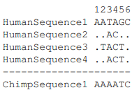

Se le llama a un sitio un “singletón” si el mutante está presente en una sola copia, “doubletón” si está presente en dos copias, y así sucesivamente.

vSFS = 1, 1, 3, 2

Singletons : 2 \
Doubletons : 1 \
Tripletons : 1

**A folded spectrum**
En lugar de contar los mutantes, contaremos el alelo más raro (a veces llamado alelo de menos frecuencia) en cada sitio.

vSFS = 1, 1, 1, 2

Singletons : 3 \
Doubletons : 1 

**Ejemplo gráfico** \
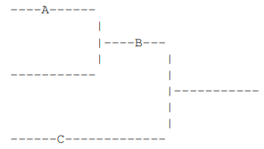 \
Las mutaciones A y C son singletons (copias únicas), mientras que B es un doubleton. Una mutación ocurrida en el intervalo coalescente más reciente solo puede ser un singleton. Una mutación en el siguiente intervalo más reciente puede ser un singleton o un doubleton. Una en el intervalo anterior a ese puede ser un singleton, un doubleton o un tripleton, y así sucesivamente. Al final esperamos 4*Nu* = *θ* mutaciones.

Nótese que al aumentar el tamaño de la muestra, el número de mutantes en cada categoría no cambia. Simplemente se añade una nueva categoría en el extremo derecho del espectro.

Para utilizar la fórmula teórica con datos, podemos usar el estimador 𝜃. \
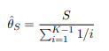 \
**La suma del espectro observado es igual al número de sitios segregantes S** 

**Ejemplos**
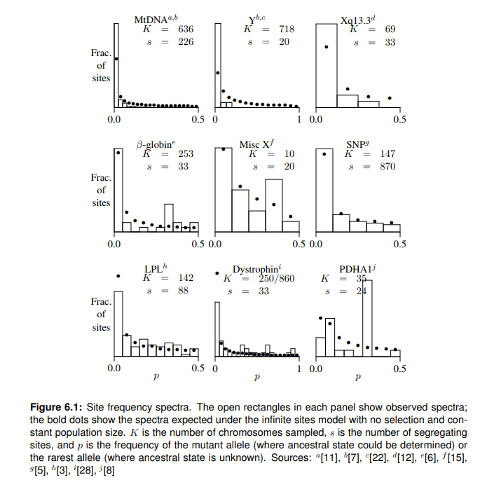

**Simulaciones de poblaciones estacionarias.**
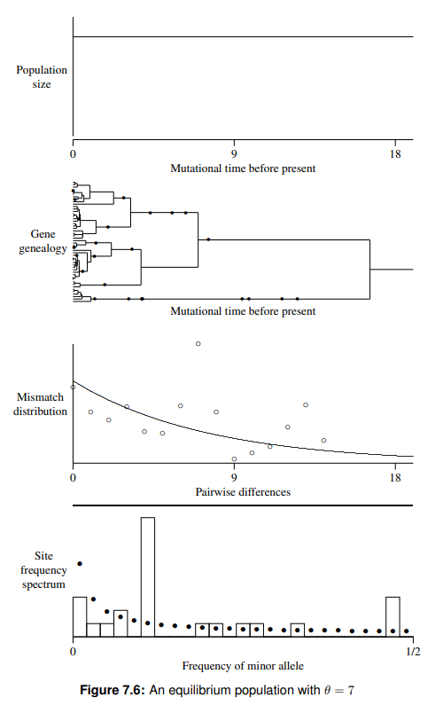
Las distribuciones simuladas de distribuciones pareadas suelen presentar una estructura irregular, con múltiples picos. Asimismo, los espectros de frecuencia de sitios muestran desviaciones notables con respecto a los valores esperados bajo modelos neutros.

**Simulaciones de poblaciones con expansión poblacional.**
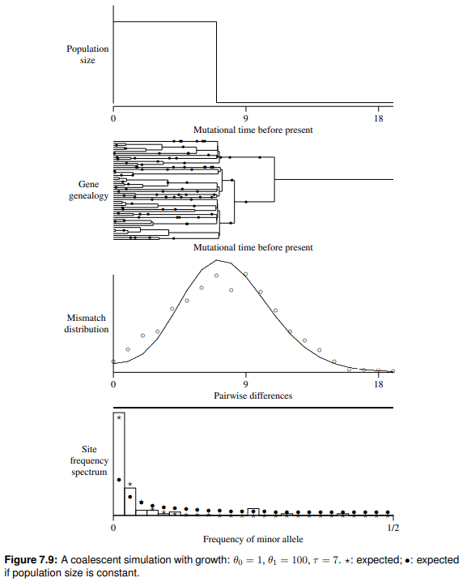

En las **genealogías de genes** de **poblaciones en expansión** los eventos de coalescencia ocurren raramente durante el período en que la población fue grande, pero ocurren rápidamente en el período anterior, cuando la población era pequeña. Esto le da a las genealogías génicas una forma similar a un peine. 
Las **distribuciones mismatch** en estas simulaciones son todas unimodales, con picos justo antes de 7. Esto refleja el hecho de que muchos pares de individuos difieren en poco más de 7 unidades de tiempo mutacional.
El **SFS** en estas simulaciones muestran un exceso de variantes únicas o singletons. Esto se debe a que las ramas terminales en las genealogías génicas son largas y acumulan una cantidad desproporcionada de mutaciones.

Esta sesión estuvo patrocinada por Alan R. Rogers 2023, [Lecture Notes on Gene Genealogies](https://content.csbs.utah.edu/~rogers/tch/ant5221/ggeneal.pdf).

#### 3.3. Computaciones bayesianas aproximadas y métodos de skyline-plot 

Contrastar hipótesis sobre la historia demográfica y la estructura poblacional mediante simulaciones o pruebas estadísticas.

**Métodos de Skyline-plot**

Todos los métodos de skyline plot se basan fundamentalmente en la teoría coalescente, la cual cuantifica la relación entre la genealogía de las secuencias y la historia demográfica de la población. La reconstrucción de esta historia demográfica implica estimar la genealogía e inferir el tamaño efectivo de la población en distintos puntos a lo largo de la escala temporal genealógica. El tamaño efectivo de la población refleja el número de individuos que contribuyen con descendencia a la siguiente generación y es casi siempre menor que el tamaño censal de la población. Este marco coalescente da origen a la mayoría de las propiedades fundamentales de los métodos skyline plot, incluidas sus suposiciones y limitaciones asociadas. \
[Skyline-plot methods for estimating demographic history from nucleotide sequences](https://onlinelibrary.wiley.com/doi/10.1111/j.1755-0998.2011.02988.x).

**Supuestos** \
El enfoque coalescente hace múltiples asunciones sobre la población de la cuál la información fue tomada: \
**1)** Las secuencias deben obtenerse de individuos que hayan sido muestreados aleatoriamente de una población panmíctica. \
**2)** También se asume que las secuencias muestreadas son ortólogas, no recombinantes. \
**3)** Las secuencias evolucionan de manera neutra. \
**Nota:** las estimaciones demográficas mejoran considerablemente al incluir múltiples loci no ligados. \
**Nota 2:** En poblaciones altamente estructuradas, es recomendable analizar las subpoblaciones por separado para cumplir con la suposición de panmixia.

**Marco metodológico básico** \
La reconstrucción de la historia demográfica a partir de un alineamiento de secuencias implica dos pasos: \
**(i)** estimar la genealogía a partir de los datos de secuencia. \
**(ii)** estimar la historia poblacional con base en la genealogía. \
Algunos métodos combinan estos dos pasos en un solo marco analítico, lo que permite la coestimación simultánea de la genealogía y la historia poblacional a partir del alineamiento.

**Estimar la genealogía** \
La genealogía incluye las relaciones entre los individuos (topología del árbol), así como sus tiempos de divergencia.
Las longitudes de las ramas del árbol son proporcionales al tiempo, el cual puede medirse en mutaciones, años o generaciones. \
La estimación de la genealogía conlleva un cierto grado de error, tanto en lo que respecta a la topología como a las longitudes de las ramas. \
La incertidumbre en la estimación genealógica, o “error filogenético”, puede ser considerable si la genealogía contiene ramas internas cortas. Esto puede deberse a una baja tasa de mutación o a intervalos de tiempo cortos entre nodos. \
Además, dado el nivel generalmente modesto de variación genética a nivel intraespecífico en organismos de evolución lenta, como los vertebrados graandes, las longitudes de las ramas en la genealogía suelen presentar una gran cantidad de variación estocástica.

**(ii)** estimar la historia poblacional \
Para reconstruir la historia demográfica, los métodos skyline plot aprovechan una relación relativamente simple entre el tamaño poblacional y la longitud esperada del intervalo coalescente. \
Específicamente, el tamaño poblacional medio en cada intervalo puede estimarse mediante el producto del tamaño del intervalo (γi) y i(i – 1)/2, donde i es el número de linajes genealógicos en dicho intervalo. \
La reconstrucción de la historia de la población a partir de la genealogía suele conllevar una considerable incertidumbre, denominada aquí «error de coalescencia». Este error aumenta hacia la raíz de la genealogía, donde la historia de la población se reconstruye a partir de un menor número de linajes.

**Estimación de la historia demográfica a partir de una genealogía**
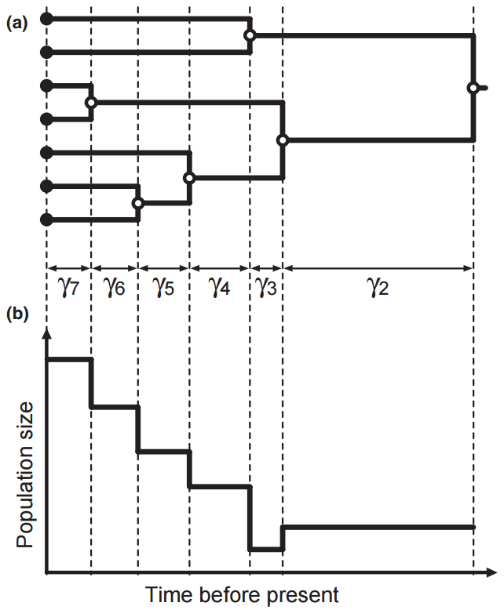

**(a)** Una genealogía estimada con longitudes de rama proporcionales al tiempo. Los círculos rellenos indican nodos terminales (individuos muestreados), mientras que los círculos vacíos indican nodos internos. Los intervalos coalescentes, denotados por γᵢ, están delimitados por nodos sucesivos en orden cronológico dentro del árbol. \
**(b)** El tamaño efectivo de la población (Nᵢ) se estima para cada intervalo coalescente usando la relación 𝑁𝑖=𝛾𝑖⋅𝑖(𝑖−1)/2, donde i representa el número de linajes presentes durante el intervalo γᵢ.

**Diferentes métodos de Skyland-plot**
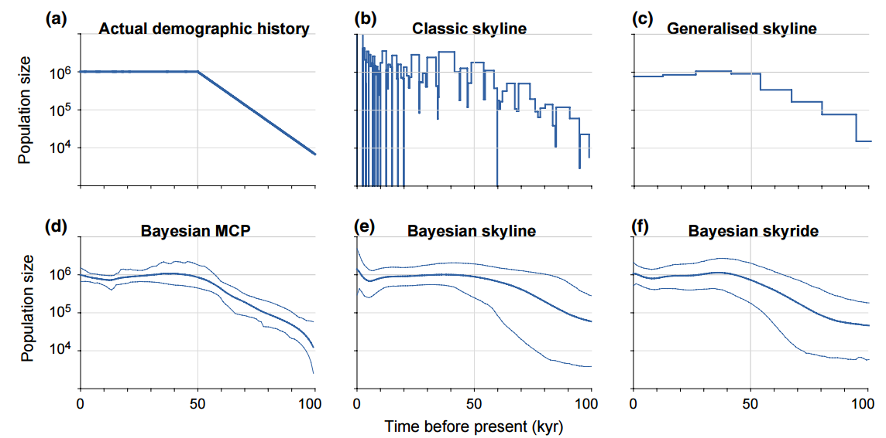

**Classic skyline** en este método, la genealogía de las secuencias debe obtenerse de forma independiente y se asume que es conocida sin error (es decir, el error filogenético es negligible). Se estima un tamaño poblacional distinto para cada intervalo coalescente en la genealogía, siguiendo la relación descrita anteriormente. \
Debido al número de parámetros libres, este método tiende a producir reconstrucciones ruidosas de la historia demográfica.
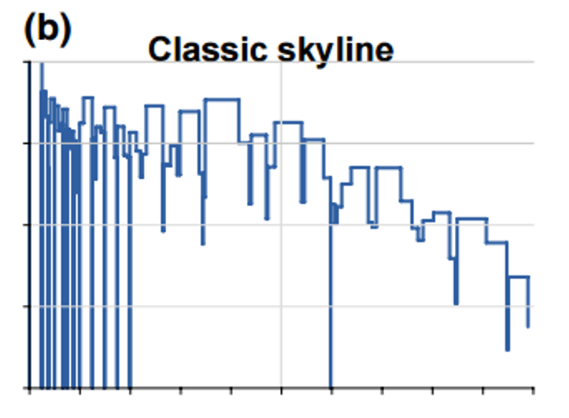

**Generalized skyline** La presencia de intervalos coalescentes cortos puede generar una gran cantidad de ruido en las reconstrucciones demográficas obtenidas mediante el skyline plot clásico. Para abordar este problema, el skyline plot generalizado elimina los intervalos cortos agrupándolos con sus vecinos si están por debajo de una cierta longitud (ε). \
La elección del valor óptimo de ε, que puede determinarse objetivamente mediante el criterio de información de Akaike corregido (Akaike 1974), representa un compromiso entre eliminar el ruido del skyline plot y conservar la señal demográfica subyacente. Este método también asume que el error filogenético es negligible. 
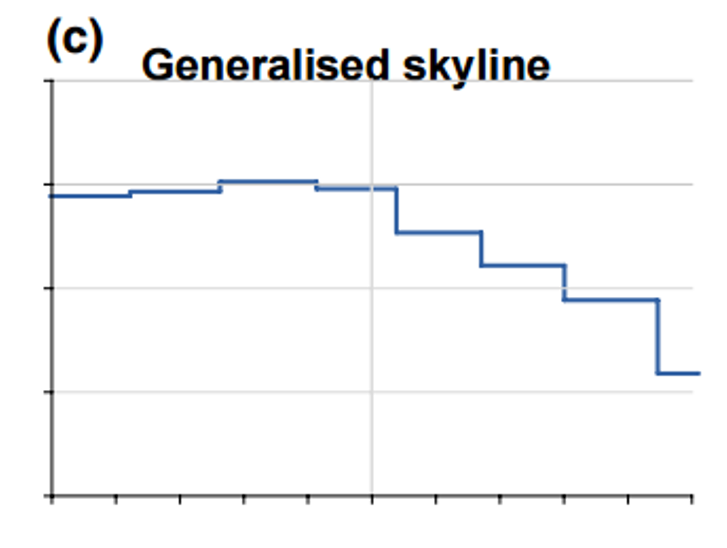

**Bayesian multiple-change-point** en este enfoque el tamaño poblacional está autocorrelacionado en el tiempo, de modo que es poco probable que se experimenten cambios en el tamaño poblacional drásticos y rápidos. 
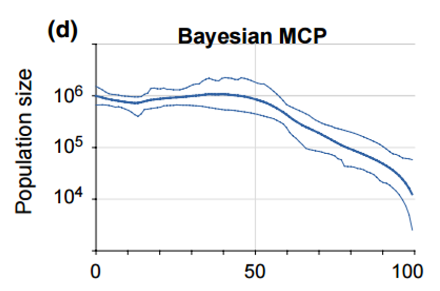

**Bayesian skyline** se implementó en un marco analítico en el cual la genealogía, la historia demográfica y los parámetros del modelo de sustitución se coestiman en un solo análisis. \
El gráfico resultante de la historia poblacional, que se obtiene promediando a lo largo de la muestra posterior de tamaños poblacionales en el tiempo (como en el método bayesiano de múltiples puntos de cambio), incluye intervalos de credibilidad que representan la incertidumbre combinada filogenética y coalescente, y tamnbién se asume que los tamaños poblacionales en intervalos coalescentes sucesivos están correlacionados. \
Ambos métodos emplean un modelo de tamaño poblacional constante por tramos, en el que el tamaño de la población es constante dentro de cada intervalo y cambia de manera instantánea entre intervalos sucesivos. Ambos métodos permiten agrupar múltiples intervalos coalescentes, lo que ayuda a reducir el ruido asociado con intervalos coalescentes cortos. \
A diferencia del skyline plot generalizado, el skyline plot bayesiano requiere que el número de grupos se elija a priori.
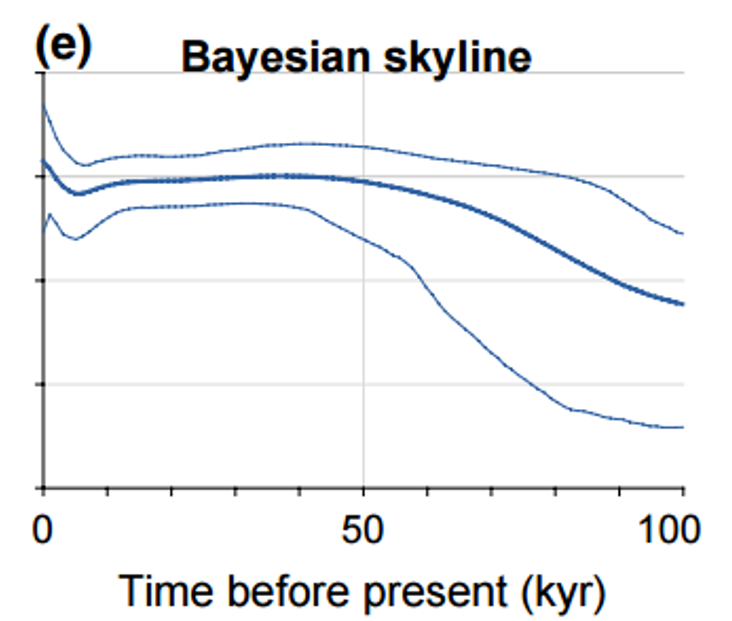

**Bayesian skyride** asume que existe cierto grado de autocorrelación en el tamaño poblacional. En este método, las diferencias entre los tamaños poblacionales en intervalos coalescentes sucesivos son penalizadas, siendo la penalización dependiente de la duración de los intervalos coalescentes o independiente del tiempo. \
La penalización dependiengte del tiempo sobre los cambios en el tamaño poblacional contrasta con el enfoque independiente del tiempo utilizado en el Bayesian skyline plot. 
En este último, la penalización depende únicamente de la magnitud del cambio, sin importar la duración del intervalo coalescente. \
En el enfoque dependiente del tiempo, la penalización se reduce efectivamente para intervalos coalescentes más largos. Esto equivale a asumir que el tamaño poblacional cambia de manera gradual a lo largo del tiempo.
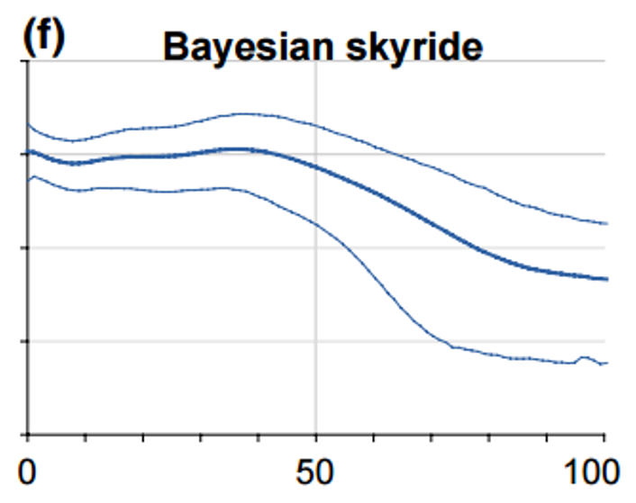

**Extended Bayesian skyline** los métodos previos de skyline plot se basaban en genealogías individuales, lo que impide el análisis simultáneo de múltiples loci. Esto se debe a que una genealogía individual solo representa una realización única de un proceso estocástico (el coalescente). \
El *extended Bayesian skyline plot* permite el análisis de múltiples loci no ligados. Aumentar el número de loci independientes permite evaluar la incertidumbre en el coalescente, lo que mejora la confiabilidad de la inferencia demográfica y reduce sustancialmente el error de estimación.
Al igual que con los métodos Bayesian skyline y skyride, la genealogía, la historia demográfica y otros parámetros del modelo pueden ser coestimados. \
Asimismo, diferentes particiones del conjunto de datos pueden recibir modelos de sustitución independientes, lo que permite que la tasa y el patrón del proceso evolutivo varíen entre loci.

**Comparación de métodos de skyline plot para estimar la historia demográfica a partir de datos de secuencias de ADN**
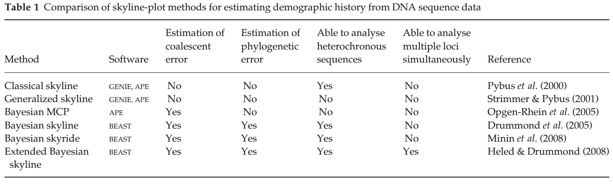

**Otras fuentes de error a tomar en cuenta**

 **Temporalidad de las muestras**. \
**Selección** existe abundante evidencia de que el genoma mitocondrial está sujeto a selección purificadora en escalas de tiempo cortas. \
**Daño del DNA** se han observado patrones espurios en la historia poblacional cuando se introdujo artificialmente daño postmortem en datos de ADN antiguo. \
**error en la secuienciación** incluso niveles muy bajos de error en la secuenciación (0.01%) pueden resultar en una duplicación del error de estimación.

**Conclusión** \
Los ***métodos de skyline plot*** constituyen un conjunto poderoso de técnicas para inferir cambios pasados en el tamaño poblacional a partir de datos de secuencias. Aunque presentan varias limitaciones importantes, su aplicación a datos reales ha demostrado el potencial de estos métodos para esclarecer patrones complejos de historia demográfica.

**Approximate Bayesian Computation**

**Para qué se ha empleado?** 
- Estimar el tamaño efectivo de la población.
- Estimar el momento y modo de eventos demográficos pasados (por ejemplo, crecimiento o disminución de poblaciones). 
- Datar la divergencia entre especies estrechamente relacionadas. 
- Hacer inferencias sobre la evolución de la poliploidía. 
- Identificar un hotspots de biodiversidad. 
- Para inferir parámetros de la teoría neutral. 
- Estimar la tasa de propagación de patógenos.
- Comparar modelos alternativos de evolución. 
- Inferir proporciones de mezcla genética. 
- Estimar tasas de migración. 
- Estimar tasas de mutación. 
- Estimar tasas de recombinación. 
- Estimar procesos de selección positiva. 
- La influencia de la selección sobre la regulación génica en humanos. 
- Estimar la edad de un alelo.

**Base tórica del ABC** \
El ABC (Approximate Bayesian Computation) tiene sus raíces en el algoritmo de rechazo, una técnica simple para generar muestras a partir de una distribución de probabilidad. El algoritmo de rechazo básico consiste en simular un gran número de conjuntos de datos bajo un escenario evolutivo hipotético. Los parámetros del escenario no se eligen de forma determinista, sino que se muestrean a partir de una distribución de probabilidad. Los datos generados por simulación se reducen luego a estadísticas resumen, y los parámetros muestreados se aceptan o se rechazan en función de la distancia entre las estadísticas resumen simuladas y las observadas.
El subconjunto de valores aceptados contiene los valores ajustados de los parámetros y nos permite evaluar la incertidumbre sobre los parámetros dados los estadísticos observados.

*Approximate Bayesian Computation en acción*
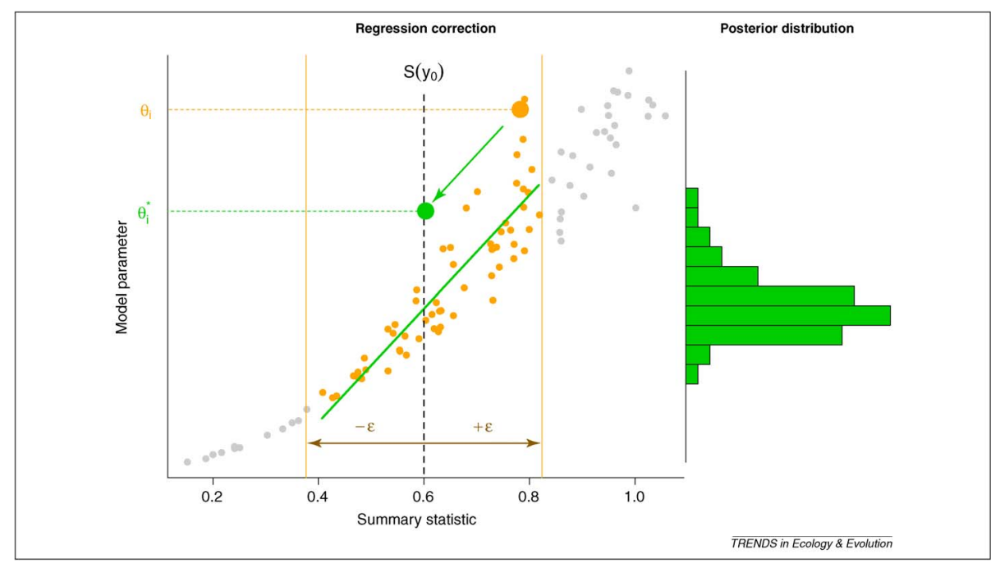
En ABC, se muestrea repetidamente un valor del parámetro, θ𝑖, a partir de su distribución *prior* para simular un conjunto de datos, 𝑦𝑖, bajo un determinado modelo. \
Luego, a partir de los datos simulados, se calcula el valor de un estadístico resumen (𝑆(𝑦𝑖), y se compara con el valor del estadístico de resumen de los datos observados, 𝑆(𝑦0), usando una medida de distancia. \
Si la distancia entre 𝑆(𝑦0) y 𝑆(𝑦𝑖) es menor que 𝜀 (valor de "tolerancia"), el valor del parámetro θ𝑖 es aceptado. \
El gráfico muestra cómo los valores aceptados de θ𝑖
(puntos en naranja) se ajustan de acuerdo con una transformación lineal. \
Después del ajuste, los nuevos valores del parámetro (histograma verde) forman una muestra de la distribución posterior.

**ABC en 3 pasos** \
*Construcción del modelo*. \
Los modelos pueden ser explicativos o predictivos.
Los modelos evolutivos tienden a ser explicativos, es decir, se utilizan para ayudar a describir los procesos evolutivos que han generado los datos. A menudo existen varios modelos explicativos potenciales para un fenómeno, y la formulación de modelos no se limita a plantear un único escenario. Frecuentemente, se pueden proponer muchos modelos explicativos distintos, con el objetivo principal de encontrar la explicación más parsimoniosa. 

**Ejemplo** \
Se plantean tres escenarios demográficos candidatos: tamaño poblacional constante, cuello de botella y divergencia.
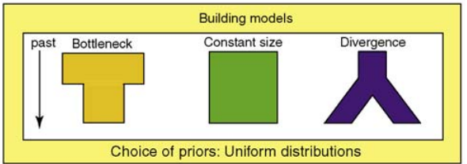

*Estadísticos de resumen*  \
La elección de las estadísticas resumen es crucial y está estrechamente relacionada con las preguntas específicas de inferencia que se abordan. De hecho, el enfoque ABC puede verse limitado por la disponibilidad de estadísticas informativas para cada parámetro particular del modelo. Por ejemplo, FST, una medida bien conocida de diferenciación poblacional, es poco informativa al estimar la tasa de migración en un modelo de divergencia con migración. \
El ajuste del modelo se basa en estadísticos de resumen como la diversidad genética. Parámetros adicionales del modelo, como el tiempo de divergencia o la duración y severidad del cuello de botella, se consideran parámetros molestos (*nuisance parameters*), y las estimaciones de *Ne* se promedian sobre estas variables.

**Ejemplo** \
Las estimaciones obtenidas bajo los modelos de cuello de botella y divergencia son cercanas al valor que se usó para generar el conjunto de datos de ejemplo (𝑁𝑒 = 600). \
**Estadísticos de resumen**
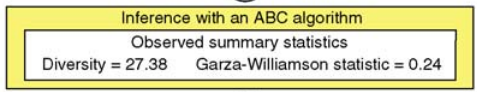
**Parámetros molestos** \
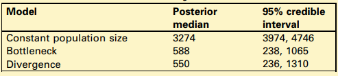

*Ajuste del modelo* \
El objetivo de este segundo paso es calcular la distribución de probabilidad posterior y un intervalo de credibilidad para los parámetros de interés, partiendo de su distribución a priori y actualizándola en función de los datos. \
Diferentes mecanismos pueden conducir a los mismos patrones en los datos, por lo que varios modelos podrían explicar los datos igualmente bien. Es decir, diferentes modelos demográficos pueden proporcionar explicaciones igualmente válidas para un patrón observado de variación genética.

**Ejemplo** \
Se encontró que el valor observado de heterocigosidad se encuentra dentro de las colas de la distribución predictiva posterior bajo los modelos de cuello de botella y divergencia, pero muy fuera de dicha distribución bajo el modelo de tamaño poblacional constante.
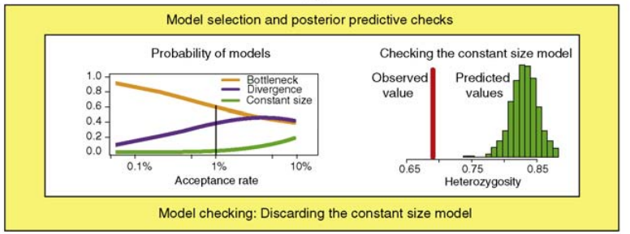

*Selección del modelo* \
Evaluar el ajuste de los modelos y compararlos son pasos fundamentales en el proceso de modelado e inferencia. En los estudios de ABC, la probabilidad posterior de un modelo dado puede aproximarse mediante la proporción de simulaciones aceptadas bajo ese modelo, mediante estimaciones por regresión logística. 
Al comparar dos modelos, a menudo se usa del factor de Bayes. En este proceso, la elección del modelo no implica necesariamente la selección de un único "mejor" modelo. En lugar de centrarnos en un único modelo, podríamos considerar la plausibilidad de cada modelo alternativo y ponderar las estimaciones de los parámetros entre varios modelos

**Ejemplo** \
Las probabilidades posteriores de los modelos, calculadas mediante regresión logística multinomial, revelan que el modelo de cuello de botella es el que recibe mayor apoyo por parte de los datos (61%), aunque el modelo de divergencia también recibe un apoyo considerable (38%).
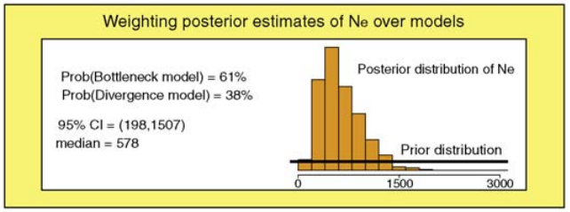

Esta sesión estuvo patrocinada por [Approximate Bayesian Computation in practice](https://www.sciencedirect.com/science/article/abs/pii/S0169534710000662) (Csilléry et al., 2010).

**DIYABC-RF** \
Es un software de inferencia que implementa el Cálculo Bayesiano Aproximado (ABC) combinado con aprendizaje automático supervisado basado en *Random Forests*, para la selección de modelos y la inferencia de parámetros en el contexto del análisis de genética de poblaciones.
Más información en [DIYABC-RF](https://diyabc.github.io). \
Aquí un vídeo con una breve explicación sobre [*Random Forest*](https://www.youtube.com/watch?v=J4Wdy0Wc_xQ).

**Modelos de divergencia para *S. boulengeri*** 
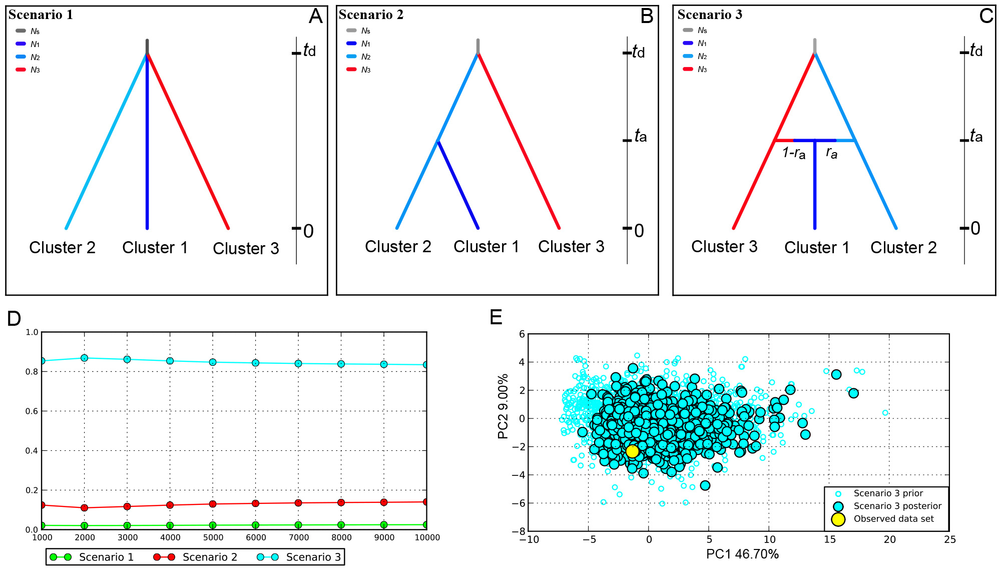
A–C: Ilustraciones de tres modelos alternativos (escenarios). \
D: La probabilidad posterior de cada modelo estimada mediante regresión logística, utilizando el 0.1% y el 1%, de los datos simulados más cercanos al conjunto de datos observado en el procedimiento de selección de modelos. \
E: Verificación del modelo y ACP (Análisis de Componentes Principales) de los datos observados, comparando las distribuciones a priori y a posteriori de los parámetros en el modelo 3. \
[A wide hybrid zone mediated by precipitation contributed to confused geographical structure of *Scutiger boulengeri*](https://www.zoores.ac.cn/en/article/id/fe47e171-d615-4c32-91fd-c7a5f7099f61) (Lin *et al*., 2023)

**Modelos poblacionales** \
Comprender la historia demográfica de las poblaciones es un objetivo clave en la genética de poblaciones. Los modelos demográficos consisten de un conjunto de poblaciones discretas, para inferir los tiempos de divergencia, flujo genético, sus tamaños y tasas de crecimiento, migración entre esas poblaciones a lo largo de varios períodos, lo que puede requerir decenas de parámetros para describirse completamente (Gower *et al*., 2022). \
[Demes: a standard format for demographic models](https://www.biorxiv.org/content/10.1101/2022.05.31.494112v1.full)

**fastsimcoal2** es uno de los software más empleados, utiliza el espectro de frecuencia del sitio (SFS) para ajustar los parámetros del modelo a los datos observados mediante la realización de simulaciones coalescentes. 

**Modelos**
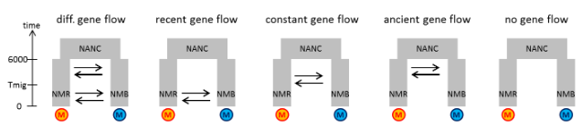
En [Demographic modeling with fastsimcoal2](https://speciationgenomics.github.io/fastsimcoal2/) puedes encontrar más información sobre el software.

**Otros modelos más complejos**
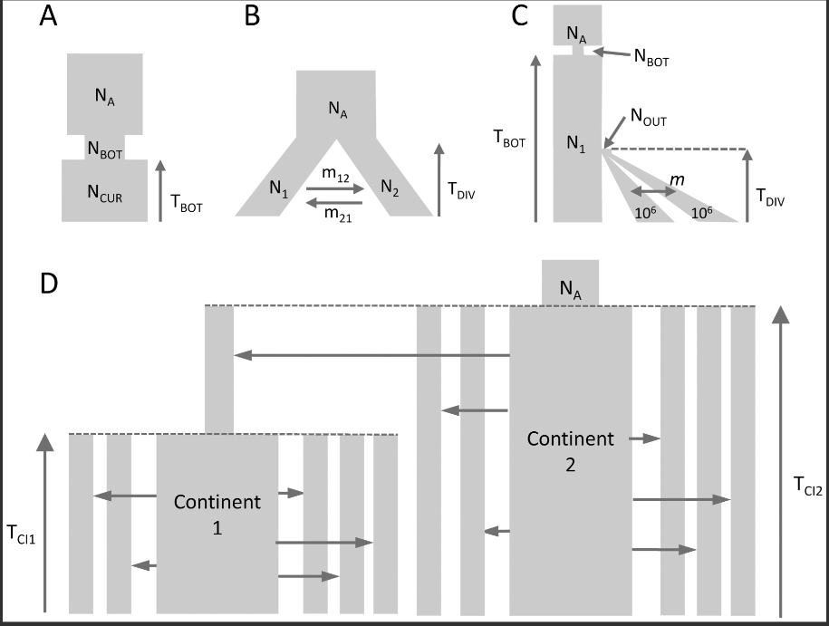
**A) Una población con cuello de botella.**
Se modela una sola población que ha experimentado un cuello de botella poblacional, es decir, una reducción drástica y temporal en su tamaño efectivo.

**B) Aislamiento de dos poblaciones con migración asimétrica.**
Dos poblaciones se separan y permanecen aisladas, pero con flujo génico asimétrico entre ellas, lo que significa que una de las poblaciones aporta más genes a la otra.

**C) Divergencia de tres poblaciones con migración y cuello de botella.**
Este modelo representa aproximadamente la diferenciación humana, donde N1 sería el tamaño de una población africana, y TDIV correspondería a la salida de una población que se divide en poblaciones asiáticas y europeas. Estas últimas crecen de forma exponencial y aún intercambian migrantes a una tasa m. Se asume que el tamaño actual de la población en expansión es conocido y equivale a 1 millón de diploides.

**D) Divergencia de dos estructuras tipo continente-isla.**
Se asume que dos sistemas continente-isla se formaron hace TCI1 y TCI2 generaciones, siendo el continente más joven originado a partir de una de las islas del Continente 2. Los parámetros de interés son el número de genes migrantes por generación (M = 2Nm) desde cada continente hacia cada isla, la antigüedad de los continentes, y el tamaño de la población ancestral NA. Los tamaños de las poblaciones insulares se fijaron en 500 diploides y el valor de M varía según las tasas de inmigración m, que pueden diferir entre islas.

**Demographic models of four human populations.**
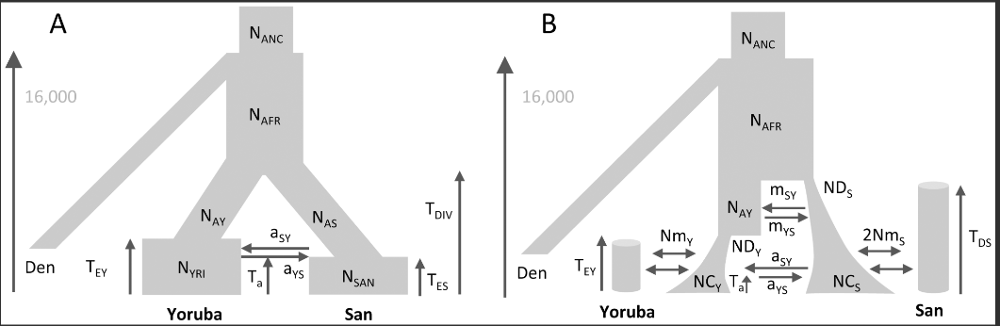
**A)** Modelo simple de divergencia poblacional. Se asume que las poblaciones San y Yoruba se separaron de una población africana ancestral y atravesaron un aumento reciente en su tamaño poblacional. También experimentaron un único pulso de flujo génico asimétrico (admixtura) hace Ta generaciones. 

**B)** Escenario más complejo, en el que los grupos San y Yoruba pertenecen a dos estructuras tipo continente-isla distintas, que también se mezclaron de forma asimétrica hace Ta generaciones. Las poblaciones ancestrales de los Yoruba y los San habrían experimentado un crecimiento exponencial en diferentes momentos, y habrían intercambiado genes justo después de su divergencia, hasta hace TEY generaciones.

En ambos modelos, se asumió que la población Denisova se separó de la población humana ancestral hace 16,000 generaciones, basada en un tamaño poblacional ancestral de 10,000 diploides. Esta fecha correspondería a aproximadamente 400,000 años, asumiendo un tiempo generacional de 25 años. \
[Robust Demographic Inference from Genomic and SNP Data](https://journals.plos.org/plosgenetics/article?id=10.1371/journal.pgen.1003905) (Excoffier 2013).

#### 4.4. Estadística filogeográfica II

##### Actividad 4 
1) De los artículos que revisaron, presentar brevemente los métodos, análisis y resultados. 
2) Escoger un análisis y desarrollarlo en detalle: 
Cuál es su base teoríca? 
Qué tipo de datos se requieren? 
Qué pregunta responde? 
Qué se puede interpretar a partir de sus resultados? 
Cómo se relaciona con su estudio? 
Qué necesitarían hacer/tener para realizar ese análisis. 
(10 mins máx).

##### Práctica 4:
En esta prática vamos a reproducir algunos de los análisis  realizados en [(Lyubas et al., 2023)](https://www.mdpi.com/1424-2818/15/2/260#app1-diversity-15-00260).

- Red de Haplotipos
- Mapa de distribución de haplotipos
- PCA
- Barrier/Geneland
- Diversidad haplotípica
- Diversidad nucleotídica
- *F*ST
- AMOVA
- Skyline plot

